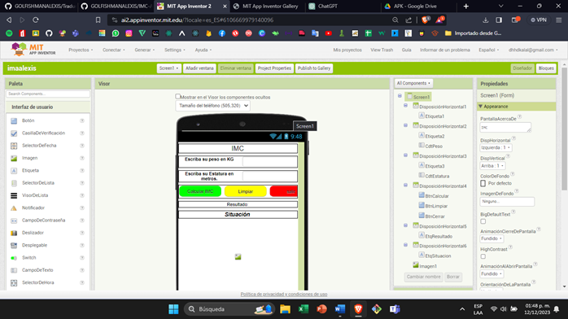
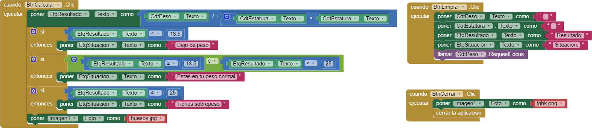

# IMC PROYECTO 3

## COMPONENTES

## - Tiene una primera disposición horizontal con una etiqueta que contiene el título.

## 

## - En la disposición dos tiene la etiqueta dos y contiene el peso en kilogramos.

## 

## - La disposición 3 continúa con una etiqueta y un texto que contiene la estatura.

## 

## - En la disposición cuatro contiene cuatro botones:

## - Botón calcular

## - Botón limpiar

## - Botón cerrar

## 

## - Tiene una disposición 5 con etiqueta del resultado.

## 

## - Una disposición 6 con etiqueta de la situación en que se encuentra, que incluye:

## - Peso bajo

## - Peso normal

## - Peso alto

## - Una imagen que muestra, al presionar calcular IMC, la situación en que te encuentras.

## BLOQUES

## 

Al ingresar tu estatura y tu peso la fórmula dividirá y hará las operaciones para que el resultado que te votes era tu índice de masa corpora si está menos de 18 estar abajo tu peso si está más de 25 menos de 25 tú peso estará normal y si está a más de 25 estás en sobrepeso y se pone una imagen alusiva

## LINK DE GALERIA
<a href="https://gallery.appinventor.mit.edu/?galleryid=69e0be37-40d7-46c2-9834-53ed684863aa" style="text-decoration: none; display: inline-block; padding: 10px 20px; border: 2px solid #555; border-radius: 5px; background-color: #007bff; color: #fff; font-size: 16px;" rel="noopener">
  GALERÍA
</a>

## link de APK
<a href="https://drive.google.com/file/d/1wGBtE7M44i2pU9_1qvmRk6MNP9Ll568j/view?usp=sharing" style="text-decoration: none; display: inline-block; padding: 10px 20px; border: 2px solid #555; border-radius: 5px; background-color: #007bff; color: #fff; font-size: 16px;" rel="noopener">
  APK
</a>

